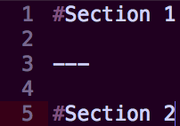

##Reveal Markdown / GH-Pages
#####_(Making creating presentations, feel like more like more like programming)_
<p>
	</br>
	  <small>Alex Niderberg</a> | <a href="https://twitter.com/alexniderberg">@AlexNiderberg</a></small><br/>
	<small>Technical Product Owner / Master Software Engineer <br/><br/>@ Capital One Labs</small>
</p>


###Presentation Objectives
- Provide an understanding of Reveal Markdown
- Set you up to create future presentations in this style


<br>
<small><a href="http://capitalonecareers.com/">Capital One</a></small>


<br>
<small><a href="https://www.capitalonelabs.com/#/about">Capital One Labs</a></small>

---

###Making creating presentations feel more like programing
####_(Using reveal.js, Markdown and GH-Pages)_


###Turns this


- [Markdown Docs](https://daringfireball.net/projects/markdown/syntax)


###Into this


###Using this


- [Reveal.js repo](https://github.com/hakimel/reveal.js)

---

###Hands-on - Working through updating required settings
```
git clone https://github.com/aln787/revealGhPages.git
cd revealGhPages
git remote rm origin
subl .
# or open with the editor of your choice
```
- Follow along in the next couple of sections to configure and deploy your own Reveal.js Gh-Pages presentation. 


####View the presentation locally (Serve the files)


###HTTP Server
<br>
####Install 
```
#Install NPM
curl https://npmjs.org/install.sh | sh
#If you already have NPM
npm install http-server -g
```

####Serve Content
```
http-server -p 8082
```
<br>
 - [Documentation](https://www.npmjs.com/package/http-server)

---

#Settings / Config


###Add your presentation title and description
```
subl index.html
#or vi index.html
```

```
<head>
        <meta charset="utf-8">
        <title>`Your presentation Title`</title>
        <meta name="description" content="`your presentation description`" />
```
- Modify this file to include the title of your presentation


###Settings
```
subl index.html
```

```
<body>
        <div class="reveal">
            <div class="slides">
                <!-- for details, see: https://github.com/hakimel/reveal.js/#external-markdown -->
                <section data-markdown="presentation.md"  
                         data-separator="^---"  
                         data-separator-vertical="^\n\n"  
                         data-separator-notes="^Note:"  
                         data-charset="iso-8859-15">
                </section>
            </div>
        </div>
```


###Presentation Source
```
data-markdown="presentation.md"   
```
- "presentation.md" - is the name of the file that contains the presentation markdown
- You can change the file name if you prefer a different name


###New Section
```
data-separator="^---" 
```
- `\n---\n` - is the indicator that you want to add a new section (a horizontal transition)




###New slide in the current section
```
data-separator-vertical="^\n\n"
```
- "^\n\n" - is the indicator that you want to add additional content to a section (a vertical transition)


###Add speaker notes
```
data-separator-notes="^Note:"
```
- "^Note:" - is the indicator that you would like to add speaker notes


####View speaker notes (hit the "s" key)

Note:Hit "s" while viewing the presentation in the browser to view the speaker notes.


###Configure the theme / styling
```
subl index.html
```

```
<link rel="stylesheet" href="css/reveal.css">
<link rel="stylesheet" href="css/theme/black.css" id="theme">
```


###Determine your desired theme and optionally modify
- [Preview the available themes](http://lab.hakim.se/reveal-js/#/themes)
- View themes locally / modify


Note:The styles are just CSS files so you can modify or create your own.

---

###Tips and Tricks


###Images with alternate sizes
```
# #becomes

```
- Example on the next slide
Note:Occasionally you will have images that don't fit on the page with the default markdown image syntax.


###Embeded Youtube videos
```
<iframe id="ytplayer" type="text/html" width="640" height="390"
  src="http://www.youtube.com/embed/L0MK7qz13bU?autoplay=0&start=65"
  frameborder="0"/>
```
- Example on the next slide


<iframe id="ytplayer" type="text/html" width="640" height="390"
  src="http://www.youtube.com/embed/L0MK7qz13bU?autoplay=0&start=65"
  frameborder="0"/>


###Embeded GIF's
```
<iframe src="http://giphy.com/embed/vBVCam8nE7uxy?hideSocial=true" width="680" height="567" frameborder="0" class="giphy-embed" allowfullscreen=""></iframe>
<!-- GetTheBabby-vBVCam8nE7uxy -->
```
- Example on the next slide


<iframe src="http://giphy.com/embed/vBVCam8nE7uxy?hideSocial=true" width="680" height="567" frameborder="0" class="giphy-embed" allowfullscreen=""></iframe>

---

###Github API / Deploy to Gh-Pages


###GH-Pages Set-up


###Create new repository


###Name repository


###Copy your new origin


###Add your remote and deploy your presentation
```
git remote add origin <your new repository>
git status
git commit -a
git push origin gh-pages
```
- View your deployed site: `<username>.github.io/<project name>`


###Success!!!
<iframe src="http://giphy.com/embed/PzOm3LPWu7fJS?hideSocial=true" width="680" height="567" frameborder="0" class="giphy-embed" allowfullscreen=""></iframe>
<!-- victory-reaction-jennifer-lawrence-PzOm3LPWu7fJS -->


###Add new remote repository using the Github API
- Details to be added at a later point
  - This can replace the screen shot based approach

---

###Thank you!!! 
